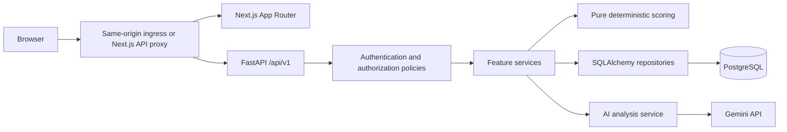
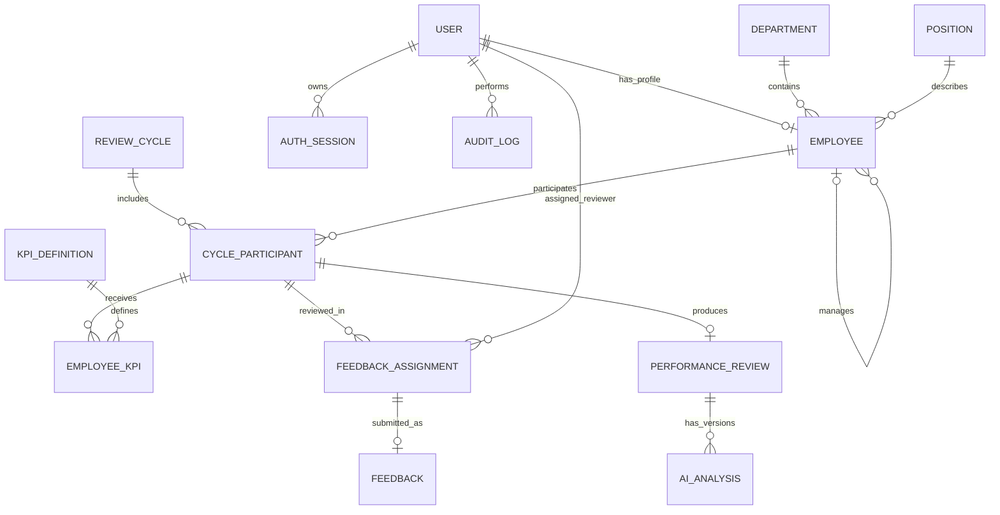

# InsightHR architecture proposal

Date: 2026-10-03  
Status: Approved; Phase 1 foundation implemented on 2026-10-03.

## Implementation status

Phase 1 foundation includes repository conventions, FastAPI configuration and error handling, PostgreSQL/Alembic readiness, the Next.js system-status page, production Dockerfiles, Docker Compose, and CI verification. Authentication and all performance-management domain features remain planned for later phases. The detailed implementation and verification record is in `docs/superpowers/plans/2026-10-03-phase-1-foundation.md` and `docs/deployment.md`.

## Purpose and existing workspace

InsightHR is a university capstone for employee performance management. The demonstration must connect employee records, review cycles, KPI assignments, authorized 360-degree feedback, reproducible performance calculations, and explicitly requested advisory Gemini analyses.

The inspected workspace is empty and is not a Git repository. There is no existing application architecture to preserve. This proposal establishes the requested `hrm-ai/` project without introducing application code or installing dependencies.

Scope excludes payroll, attendance, recruitment, CV parsing, chat, microservices, Kafka, Redis, vector databases, and Helm. Use fictional data in demos. No external service is required for numeric scoring.

## 1. Proposed architecture

### Options and recommendation

| Option | Advantages | Tradeoffs |
| --- | --- | --- |
| **Feature-oriented modular monolith, recommended** | One API and database; explicit service boundaries; straightforward transactions and deployment | Requires disciplined boundaries and shared authorization policies |
| Generic CRUD-first monolith | Quick initial screens and endpoints | Lifecycle, authorization, scoring, and audit rules become scattered as workflows expand |
| Separate scoring and AI services | Independent deployments | Additional authentication, network failures, and operational cost without a capstone benefit; outside requested scope |

Use one Next.js frontend, one FastAPI backend, and one PostgreSQL database. Organize backend code by feature, with API, schema, service, and repository files within each feature. Cross-feature operations use service interfaces; repositories own SQL queries, while services own business rules and transaction boundaries.



### Frontend

- Next.js App Router and strict TypeScript; Tailwind, shadcn/ui, and Lucide for the responsive SaaS shell.
- TanStack Query handles client-side server state, pagination, and mutation invalidation. React Hook Form with Zod handles forms; backend validation remains authoritative.
- Recharts renders department comparisons and score distributions. Avoid decorative charts.
- Shared API client normalizes errors and uses cookie credentials. Protected pages obtain the current user; role-based navigation improves usability while backend policies enforce access.
- A same-origin `/api/v1/*` proxy routes requests to FastAPI in Compose. Kubernetes ingress routes that prefix directly to the backend. Do not maintain a second business API inside Next.js.
- Protected responses and personalized pages are not publicly cached. Login and expired-session states redirect to `/login`.
- Employee performance is the main demonstration screen: identity, period, total and component scores, KPI table, aggregated feedback, advisory AI result, and development actions.

### Backend

- FastAPI handles routing, dependencies, validation, and HTTP translation. Route handlers call services rather than implementing business rules.
- SQLAlchemy 2 uses synchronous sessions and psycopg initially; synchronous route handlers avoid blocking the async event loop with database work. Alembic owns schema changes.
- Services use one unit of work for a business operation and its audit event. Repositories do not commit independently.
- Policies check role and resource scope, including employee ownership, direct reports, and explicit feedback assignments.
- A pure scoring module receives validated numeric inputs and a configuration snapshot. It has no database, HTTP, or Gemini dependency.
- An isolated Gemini adapter validates structured responses. The analysis service snapshots evidence, calls Gemini outside a database transaction, then stores the result only if the review version still matches.
- Central error handling produces `{ "error": { "code": "...", "message": "...", "details": [] }, "request_id": "..." }`. Expected conflicts map to 409, invalid requests to 422, authentication failures to 401, and forbidden actions to 403. Resource-scoped queries can return 404 to avoid disclosing inaccessible records.
- `/health/live` checks process availability; `/health/ready` checks database connectivity and migration compatibility. Gemini availability does not determine readiness.

### Authentication and deployment

- Use Argon2id password hashes. Short-lived signed access tokens and opaque, random refresh tokens are delivered in HttpOnly cookies; PostgreSQL stores only refresh-token hashes.
- Initial policy: 15-minute access lifetime, seven-day absolute refresh-session lifetime. Rotation consumes a refresh token atomically, creates its successor, and detects reuse by revoking the session family.
- Access authentication checks the referenced session is active and loads the user's current role and status. Logout revokes the session and clears cookies, immediately invalidating its access tokens.
- Cookies use Secure in HTTPS environments, SameSite=Lax, and scoped paths. Local HTTP development has an explicit nonproduction cookie setting. Use an exact allowed-origin check and a session-bound CSRF token for mutations; login also checks origin. Cookie-authenticated APIs reject cross-origin mutations.
- Secrets are environment configuration. Configuration examples contain placeholders, never deployed secrets. Startup rejects default secrets outside development.
- Compose runs web, API, and PostgreSQL with a database volume and health checks. A one-off API command runs migrations; seeding is explicit and repeatable. Images run as nonroot, with a multi-stage web build and Next.js standalone output.
- Basic Kubernetes uses the same images, one API replica and one web replica initially, a demo PostgreSQL StatefulSet and PVC, Services, ConfigMap, Secret template, ingress, and a one-off migration Job. kind/k3d instructions include ingress-controller installation and local image loading. Database containers are for a local demo; a production deployment requires a separate operational design.

## 2. Proposed repository tree

The following is the planned tree, not a claim that these files have been implemented.

```text
hrm-ai/
  apps/
    web/
      src/
        app/
          (auth)/login/page.tsx
          (app)/layout.tsx
          (app)/dashboard/page.tsx
          (app)/employees/page.tsx
          (app)/employees/[id]/page.tsx
          (app)/departments/page.tsx
          (app)/review-cycles/page.tsx
          (app)/review-cycles/[id]/page.tsx
          (app)/kpis/page.tsx
          (app)/performance/page.tsx
          (app)/feedback/page.tsx
          (app)/ai-reports/page.tsx
          (app)/settings/page.tsx
        components/{ui,layout,charts}/
        features/{auth,employees,organization,cycles,kpis,feedback,performance,ai}/
        lib/{api,query,validation}/
      package.json
      next.config.ts
      tsconfig.json
    api/
      app/
        main.py
        core/{config,database,errors,security,policies}.py
        modules/
          auth/
          users/
          organization/
          employees/
          review_cycles/
          kpis/
          feedback/
          performance/
          ai_analysis/
          dashboard/
          audit/
          settings/
        # Feature modules contain router.py, schemas.py,
        # service.py, repository.py, and models.py as needed.
        scoring/{rules,calculator}.py
        integrations/gemini.py
        seed.py
      alembic/versions/
      alembic.ini
      tests/{unit,integration}/
      pyproject.toml
  infrastructure/
    docker/{web,api}.Dockerfile
    kubernetes/
      namespace.yaml
      configmap.yaml
      secret.example.yaml
      web-deployment.yaml
      web-service.yaml
      api-deployment.yaml
      api-service.yaml
      postgres-statefulset.yaml
      postgres-service.yaml
      postgres-pvc.yaml
      migration-job.yaml
      ingress.yaml
      kind.yaml
  docs/
    architecture.md
    database.md
    api.md
    ai-design.md
    deployment.md
  docker-compose.yml
  .env.example
  .gitignore
  README.md
```

## 3. Database ERD

Use UUID primary keys consistently, timezone-aware UTC timestamps, and fixed-precision numeric columns for scores and weights. Store review periods as dates. Mutable entities have `created_at`, `updated_at`, and a version where concurrent edits matter.



Supporting entities resolve authorization, refresh rotation, and historical consistency; they are part of the monolith rather than new subsystems.

| Entity | Important fields and constraints |
| --- | --- |
| User | normalized email unique, password_hash, role enum, is_active; never include hashes in API serialization |
| AuthSession | user_id, family_id, token_hash unique, expires_at, consumed_at, revoked_at, replacement_id; retain consumed hashes until expiry for replay detection |
| Department | unique code, name, is_active |
| Position | unique code, title, is_active |
| Employee | user_id unique and nullable, unique employee_code, display_name, department_id, position_id, manager_id nullable, employment_status; manager cannot equal employee |
| ReviewCycle | name, start_date, end_date, status, frozen scoring_policy JSON; start <= end; lifecycle DRAFT/ACTIVE/CLOSED |
| CycleParticipant | employee_id, cycle_id, manager snapshot, department/position snapshots, version, optional finalization timestamp; unique employee/cycle; stores historical reporting context |
| KPIDefinition | unique code, name, description, unit, direction HIGHER_IS_BETTER/LOWER_IS_BETTER, is_active |
| EmployeeKPI | participant_id, definition_id, definition snapshot, target, actual nullable, weight, score nullable; unique participant/definition; target > 0, actual >= 0, 0 < weight <= 100 |
| FeedbackAssignment | participant_id, reviewer_id, relationship, required, due_at, status; unique participant/reviewer; relationship SELF/MANAGER/PEER/SUBORDINATE |
| Feedback | assignment_id unique, rating 1..5, comment with bounded length, submitted_at; immutable after submission in initial scope |
| PerformanceReview | participant_id unique, kpi_score, feedback_score, final_score, calculation_version, evidence_version, evidence_snapshot JSON, policy_snapshot JSON, calculated_at, finalized_at nullable |
| AIAnalysis | review_id, calculation_version, evidence_hash, model, prompt_version, status, validated output JSON nullable, sanitized error_code nullable, generated_at nullable, requested_by; multiple generations retained |
| AuditLog | actor_id nullable, action, entity_type, entity_id, timestamp, request_id, minimal metadata; append-only through application API |
| SystemConfig | singleton/versioned default scoring configuration and operational settings; no secrets stored here |

Use foreign keys and indexes for employee/cycle queries, reviewer inboxes, department summaries, and audit timestamps. Retire reference data and deactivate users instead of deleting referenced history. Never cascade-delete submitted feedback or finalized reviews.

Aggregate weight sums cannot be enforced by a row CHECK. Submit the entire KPI allocation as one transaction, lock its participant row, and require the service to validate exactly 100.00%. A partial allocation is a client-side draft; the stored allocation must be complete. Every writer of review evidence takes the same participant lock and increments its evidence version. Employee manager changes validate that the reporting tree remains acyclic.

## 4. Main business rules

### Role and scope policy

| Operation | ADMIN | HR | MANAGER | EMPLOYEE |
| --- | --- | --- | --- | --- |
| Users, roles, system defaults | Manage | Own account | Own account | Own account |
| Departments, positions, employees | No automatic HR access | Manage | Read direct reports and self | Read self |
| Cycles and organization reports | No automatic HR access | Manage/read | Read scoped cycles/reports | Read own participating cycles |
| KPI definitions | No automatic HR access | Manage | Read applicable definitions | Read assigned definitions |
| Employee KPI allocations/results | No automatic HR access | Manage | Manage active direct reports | Read own |
| Feedback submission | Assigned only | Assigned only | Assigned only | Assigned only |
| Performance calculation | No automatic HR access | Eligible participants | Eligible direct reports | No |
| AI generation/regeneration | No automatic HR access | Yes | Read report for direct reports | Read own report |

ADMIN is a system administrator, not an implicit HR superuser. A future combined-role design would require an explicit change. Backend authorization checks current user status, role, and object scope on every protected request. User-management actions cannot deactivate or demote the last active administrator.

### Review lifecycle and history

1. HR creates a DRAFT cycle and participants. At activation, validate dates and freeze that cycle's scoring policy. Initially permit one ACTIVE cycle organization-wide.
2. HR and the current direct manager manage complete KPI allocations and actual results during ACTIVE. Definition edits never silently change assigned KPI snapshots.
3. HR assigns feedback reviewers explicitly. SELF requires the employee's own account, MANAGER requires the participant's manager snapshot, SUBORDINATE requires a snapshot of a reporting relationship, and PEER requires a different active employee. Store the eligibility snapshot at assignment time. Any assignment replacement is audited.
4. A reviewer submits only their own open assignment in an ACTIVE cycle. The server derives employee, cycle, and relationship from the assignment. A database uniqueness constraint prevents simultaneous duplicate submissions.
5. Every participant requires submitted SELF and MANAGER feedback by default; PEER and SUBORDINATE assignments are optional unless HR marks them required. Activation checks that required reviewer accounts exist. Feedback reviewers may read their own submissions; they do not gain access to the reviewed employee's performance report.
6. Calculation requires a nonempty valid KPI allocation, all actuals, and all required feedback. Missing evidence returns an actionable validation error; missing feedback is never converted to zero or silently reweighted. Dashboards show pending reviews separately from calculated scores.
7. Evidence changes invalidate the current review and any associated AI result for current-score purposes. Historical calculation snapshots and AI generations remain traceable. Recalculation updates the current review, increments its calculation version, and records an audit event.
8. HR finalizes a complete, current review. Finalized participants become immutable. A cycle closes only when all its participants are finalized. Reopening finalized reviews is excluded initially; any later correction flow must retain prior revisions.

Current managers receive scope to current direct reports; the frozen assignment determines who can submit historical manager feedback. Department comparisons use cycle snapshots to prevent transfers from rewriting history.

### Deterministic scoring

Use Python Decimal for calculation and PostgreSQL NUMERIC for storage. Weights are percentage points (70, 30, 100), not fractions. Reject NaN, infinity, negative actuals, zero/negative targets, invalid rating ranges, and configuration weights that do not sum to 100.00.

```text
HIGHER_IS_BETTER raw_score = actual / target * 100
LOWER_IS_BETTER raw_score  = target / actual * 100, when actual > 0
LOWER_IS_BETTER with actual = 0 yields the configured finite cap
normalized_kpi_score      = min(raw_score, cap), if a cap is enabled
kpi_score                 = sum(normalized_kpi_score * weight / 100)
feedback_score            = mean(submitted ratings) / 5 * 100
final_score               = kpi_score * kpi_weight / 100
                          + feedback_score * feedback_weight / 100
```

Proposed defaults: cap 100.00, KPI weight 70.00, feedback weight 30.00. Rating conversion maps 1 to 20 and 5 to 100; display that rule explicitly. All submitted assignments count equally in the initial 360 average, with relationship summaries shown separately. Relationship weighting would be a later configurable rule, not an implicit behavior.

Do not round intermediate computations; round stored/displayed component and final scores to two decimals using ROUND_HALF_UP. Calculate the final result from unrounded components. LOWER_IS_BETTER definitions require an enabled finite cap to avoid division by zero. Caps above 100 or an uncapped higher-is-better policy may produce totals above 100; UI and validation must not incorrectly clamp those totals.

Example: KPI achievements 90 and 100 with weights 60/40 give 94. Four submitted ratings averaging 4 give 80. The final score is `94 * 0.70 + 80 * 0.30 = 89.80`.

Changes to system defaults affect future activated cycles. Existing cycles retain their policy snapshots. Repeated calculation with unchanged evidence and policy returns the same numeric values. Audits record calculation version and input hash, without copying feedback comments.

### Feedback confidentiality

HR may access raw feedback for administration. Reviewers see their own submissions. Employees and managers see aggregates, their own authored content, and sanitized themes; peer/subordinate identities and individual comments are excluded from their report responses. Suppress relationship-specific summaries with fewer than three non-self/non-manager submissions. Whole-review averages remain available, with an explanation that small review groups provide limited confidentiality. No anonymity guarantee is made.

### AI reliability and data boundaries

- Only an explicit HR request invokes Gemini; viewing any page or saved report never triggers generation.
- Set `GEMINI_API_KEY`, `GEMINI_MODEL`, timeout, and bounded output size through environment variables. Model choice and current SDK/API behavior will be verified against Google's official documentation during Phase 7. Do not hard-code a model in scoring or service code.
- Send an anonymous employee reference, KPI snapshots and achievements, aggregated ratings, sanitized comments, and cycle context. Exclude names, email addresses, credentials, and reviewer identities. Structured identifiers are removed; free-text redaction is best effort and must be documented.
- Treat comments as untrusted evidence, never instructions. Gemini has no tools, database-write access, or authority to change scores.
- Request and strictly validate exactly `summary`, `strengths`, `improvement_areas`, `feedback_themes`, `recommended_actions`, and `caveats`; list fields contain bounded strings. Reject extra keys, invalid types, oversized output, and invalid JSON before persisting successful content.
- Store model, prompt version, actual generation timestamp, calculation version, and evidence hash. Keep prior successful analyses during failed regeneration.
- A request reserves a generation attempt, snapshots evidence, releases database locks, calls the provider with a timeout, and stores the validated result in a short transaction. A changed calculation version produces a stale-result conflict rather than attaching analysis to new evidence.
- Prevent parallel generation for the same review/version with a database uniqueness rule for active attempts. Persist a lease deadline so crashed attempts can be marked failed on the next request. No queue is needed initially.
- Return a sanitized provider error and allow a deliberate retry. Failure leaves the deterministic review usable. Logs never include API keys, full prompts, or raw provider responses.
- The interface labels analysis advisory and exposes limitations, generation time, and stale status. Seeded reports are labeled fictional demo analyses with `model=demo-fixture`; they are never represented as live Gemini responses.

### Dashboard definitions

Total employees counts active employee records. Average performance and distribution include only calculated reviews whose evidence versions are current for the selected cycle; show the sample size. Awaiting completion counts participants not finalized. KPI completion is assigned KPIs with actuals divided by total assigned KPIs. Department charts use participant department snapshots. Recent activities expose only policy-authorized, sanitized audit events.

## 5. REST API map

All business endpoints use `/api/v1`. Lists accept validated `page`, `page_size` (maximum 100), allowlisted sorting, and documented filters, and return `{items, total, page, page_size}`. Cycle-dependent employee requests require `cycle_id`; never select a historical cycle ambiguously.

| Method and path | Purpose and authorization |
| --- | --- |
| POST /auth/login | Verify credentials; create cookie session; origin check |
| POST /auth/refresh | Rotate refresh token atomically; CSRF and origin check |
| POST /auth/logout | Revoke current session and clear cookies |
| GET /auth/me | Current sanitized user and employee reference |
| GET, POST /users | ADMIN list/create users |
| PATCH /users/{id} | ADMIN role/status changes; last-admin protection |
| POST /auth/change-password | Authenticated user; verify old password and revoke other sessions |
| GET, POST /employees | Scoped listing; HR create |
| GET, PATCH /employees/{id} | Scoped read; HR update |
| GET, POST /departments | Scoped read; HR create |
| PATCH /departments/{id} | HR update/retire |
| GET, POST /positions | Scoped read; HR create |
| PATCH /positions/{id} | HR update/retire |
| GET, POST /review-cycles | Scoped list; HR create DRAFT |
| GET, PATCH /review-cycles/{id} | Scoped detail; HR draft changes |
| POST /review-cycles/{id}/participants | HR enroll employees in DRAFT |
| POST /review-cycles/{id}/activate | HR validate and freeze policy |
| POST /review-cycles/{id}/close | HR close after all reviews finalized |
| GET, POST /kpis | Scoped definition list; HR create |
| PATCH /kpis/{id} | HR update/retire definition |
| GET /employees/{id}/kpis?cycle_id=... | Scoped assignment list |
| PUT /employees/{id}/kpis?cycle_id=... | HR/direct manager atomically replace full allocation; expected evidence version required |
| PATCH /employee-kpis/{id} | HR/direct manager enter actual; expected evidence version required; allocation changes use PUT |
| POST /feedback-assignments | HR assign eligible reviewer for a participant |
| GET /feedback-assignments | Current user's inbox; HR may filter administration view |
| DELETE /feedback-assignments/{id} | HR cancel an unsubmitted assignment; enforce required-coverage rules |
| POST /feedback | Submit current user's assignment exactly once |
| GET /employees/{id}/feedback?cycle_id=... | Scoped, confidentiality-filtered summary; HR raw administration view |
| POST /performance/{employee_id}/calculate | HR/direct manager; cycle_id and expected evidence version in body |
| GET /performance/{employee_id}?cycle_id=... | Scoped deterministic report |
| POST /reviews/{review_id}/finalize | HR finalization of current complete review |
| POST /performance/{review_id}/ai-analysis | HR explicit generation; regenerate flag required to replace a current success |
| GET /performance/{review_id}/ai-analysis | Scoped saved analysis; never invoke Gemini |
| GET /dashboard?cycle_id=... | Role-scoped metrics and activities |
| GET /ai-reports | Scoped paginated saved analyses |
| GET, PATCH /settings/scoring | ADMIN inspect/update future-cycle defaults |
| GET /audit-logs | ADMIN system events; HR allowed HR-domain events |

The requested performance paths use employee IDs for calculation/retrieval and review IDs for AI child resources. Keep named parameters and operation IDs explicit in OpenAPI and the client to avoid confusing the two UUID types. `review_id` is returned in the performance response.

Audit employee creation/update, cycle transitions, KPI allocations/results, assignments, submissions, calculation, finalization, AI requests/results, role changes, and scoring-default changes. Mutations and their successful domain audits commit together. Failed authentication/AI attempts use separate sanitized events where useful.

## 6. Incremental implementation phases

Every phase starts by inspecting the current implementation, describing its changes, and listing schema/API impact. Finish a small working slice, run applicable checks, and fix failures before advancing. Maintain documentation with each slice; do not defer all tests until Phase 9.

| Phase | Smallest complete outcome | Database/API impact | Validation gate |
| --- | --- | --- | --- |
| 1. Foundation | Project configuration, Next.js shell, FastAPI startup, PostgreSQL connection, Dockerfiles/Compose, migration baseline | No domain tables; liveness/readiness | Backend health tests, web typecheck/build, Compose health and clean-database migration smoke test |
| 2. Authentication | Login, refresh rotation, logout, current user, ADMIN user management, shared policies | User and AuthSession; auth/users endpoints | Hash verification; invalid/inactive login; cookie/CSRF policy; refresh replay and concurrency; logout revocation; role-denied requests |
| 3. Organization | Departments, positions, employee list/detail and forms | Organization and Employee tables | Scoped reads, HR-only writes, duplicate codes, reporting-tree cycles; frontend typecheck/build |
| 4. Cycles and KPIs | Cycle enrollment/activation, definitions, complete allocations and actual entry | SystemConfig, ReviewCycle, CycleParticipant, KPI tables; relevant endpoints | Lifecycle checks, allocation sum, direct-report rules, stale-version conflict, database concurrency |
| 5. Feedback | HR assignment workflow, reviewer inbox, one-time submission, confidentiality-filtered summaries | FeedbackAssignment and Feedback | Unauthorized/self-forged relationship; duplicates including concurrent requests; required coverage; disclosure checks |
| 6. Performance | Pure scoring, calculation endpoint, main performance report, finalization | PerformanceReview and snapshots | Scoring boundaries, exact weights, missing evidence, rounding, config snapshots, invalidation, finalization locks |
| 7. Gemini | Explicit generation/regeneration and saved advisory output | AIAnalysis and generation leases | Mock valid response, failure/timeout, invalid JSON/schema, concurrent calls, stale evidence, PII exclusions; live API smoke only with configured credentials |
| 8. Dashboard/UI | Complete all requested screens, scoped dashboards/charts, fictional seed dataset | Read aggregations; idempotent demo seed | Role-specific demo walkthrough; meaningful frontend tests for refresh flow, protected navigation, and explicit AI action; typecheck/build |
| 9. Security/integration | End-to-end workflow and authorization matrix review | Targeted fixes only | Full backend suite against PostgreSQL; cross-user UUID access, CSRF, refresh races, stale reviews, AI isolation; Compose clean install |
| 10. Kubernetes/docs | Local kind/k3d manifests, migration Job, documented setup and demo | Deployment artifacts; no new domain scope | Manifest validation; local deployment readiness, ingress, persistence/restart and workflow smoke; documentation reproduction |

AuditLog is introduced with Phase 2 and extended with every domain mutation, rather than added retrospectively.

### Demo seed and acceptance workflow

Seed one ADMIN, two HR users, three managers, and eighteen employees across four departments. HR/admin need not have employee profiles unless they participate in reviews. Include two cycles (one CLOSED, one ACTIVE), multiple KPI definitions, assignments and submissions across all relationships, finalized historical reviews, pending active reviews, and labeled fictional AI fixtures. Seed credentials come from an explicit demo-password environment variable and are hashed. Seeding refuses non-demo environments by default and is idempotent using stable fictional codes.

The acceptance walkthrough logs in as HR, selects the active cycle, assigns a 100% KPI allocation, enters actuals, creates eligible feedback assignments, submits feedback through the assigned accounts, calculates the review, explicitly generates validated Gemini analysis, and confirms the dashboard reflects the resulting current review. The report must show KPI results, feedback aggregate, exact score components, advisory summary, strengths, improvements, and actions. With Gemini disconnected, calculation and the report still work and the UI offers a deliberate retry.

### Documentation and environment contract

README covers purpose, stack, setup, environment, migrations, demo seed, tests, Compose, Gemini configuration, and Kubernetes. `database.md` covers columns, constraints, snapshots, and migrations; `api.md` covers authorization, errors, pagination, and examples; `ai-design.md` covers the input contract, redaction limitations, schema, prompts, provider failures, and cost controls; `deployment.md` covers health checks, image builds, persistence, secrets, ingress, and local cluster commands.

The future `.env.example` includes PostgreSQL settings, access-signing secret, cookie security mode, allowed origin, API internal URL, Gemini key/model/timeout, and explicit seed settings. Defaults for scoring reside in validated backend configuration and are snapshotted into cycles. Browser-visible variables never contain private configuration. Pin dependencies and commit lockfiles after verifying compatible versions during implementation.

## 7. Major technical risks

| Risk | Consequence | Design response and proof |
| --- | --- | --- |
| Role-only checks without resource scope | Employees or managers access unrelated records | Central policy plus scoped repository queries; endpoint tests using another employee's UUID |
| Ambiguous scoring and missing evidence | Unreproducible or unfair scores | Explicit Decimal formulas, frozen policy, required feedback, snapshots, boundary tests |
| Concurrent KPI edits and feedback submissions | Invalid allocations or duplicate evidence | Shared participant lock, expected versions, unique constraints; real PostgreSQL race tests |
| Mutable organizational/definition data | Historical reports change after transfers or edits | Cycle and assignment snapshots, immutable finalization, versioned calculations |
| Refresh-token replay and cookie-origin mistakes | Session compromise or unintended mutations | Hashed rotating tokens, family revocation, active session check, origin and CSRF controls |
| Gemini output or comment injection | Invented claims or attempted score changes | No AI authority/tools, strict output schema, advisory UI, validation and adversarial fixtures |
| PII in free-text feedback | Unnecessary disclosure to external provider | Minimize inputs, redact identifiers, document residual free-text risk, use fictional demos |
| Gemini latency, cost, and quota failure | Slow generation or blocked provider requests | Explicit HR action, saved results, timeouts, bounded payload, per-review concurrency guard; numeric workflow remains independent |
| Misleading small-group feedback | Reviewer identity inferred from aggregates | Suppress small relationship groups, restrict individual records, disclose confidentiality limits |
| Compose/Kubernetes configuration drift | Demo cannot be reproduced | Same images and environment contract; explicit migration/seed steps and clean-install smoke tests |
| Overbuilding the capstone | Incomplete main workflow | Small gated phases, monolith, synchronous bounded AI calls, no optional infrastructure |
| Version/provider changes | Broken installation or Gemini requests | Pin verified packages and adapter contract; verify current primary documentation at implementation time |

## Review decisions

The proposal adopts these assumptions: ADMIN has system privileges without implicit HR access; KPI cap defaults to 100; feedback converts ratings with `rating / 5 * 100`; submitted reviewers count equally; SELF and MANAGER are required; a single active cycle is allowed initially; finalization locks participant evidence; HR alone requests AI generation. These are proposed business policies, not requirements already asserted by the brief.

The next deliverable after design review is a detailed Phase 1 implementation plan. No application feature is represented as implemented by this document.
